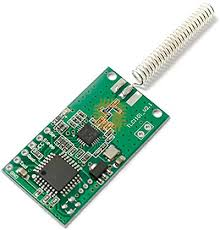
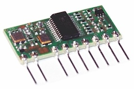
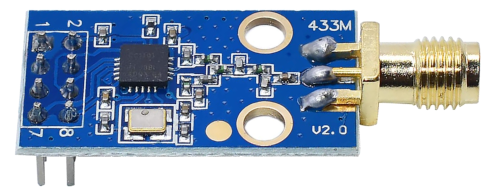
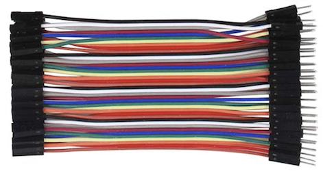
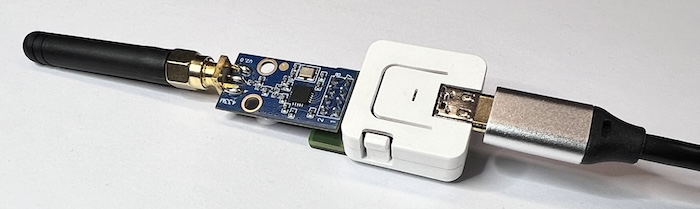
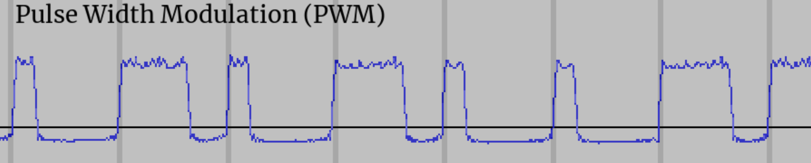
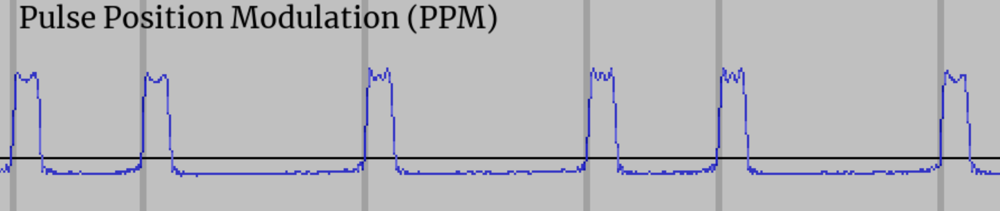

# OOKwiz - On/Off Keying ESP32 Arduino library

#### Receiving/analysing/sending signals for radio remote controls 📱, weather stations 🌦️ and more.

&nbsp;

**TL;DR**: *OOKwiz is an ESP32 Arduino library for receiving, analysing, decoding, encoding and transmitting On/Off keyed signals using a number of radios via RadioLib as well as a generic type. Radio plugins easy to build. Not just a library, also a versatile rx/tx OOK Swiss army knife. Used in a sketch that only calls the library's* `setup()` *and* `loop()` *functions, it prints output like below for received signals and provides a command line interpreter to set radio type, GPIO-pins used, etc. Settings are stored in flash on the ESP32 using SPIFFS. OOKwiz tries to read the data from messages, example:* `pulse(5906) + pwm(timing 190/575, 24 bits 0x1772A4)` *(all time in µs). That same format is among those accepted by the CLI* `transmit` *function, so on-the-fly experimentation is super-easy: just copy the string, change a few bits and transmit it back out.*

```
5906,180,581,184,578,174,600,552,203,178,592,556,207,563,218,559,197,173,594,560,215,556,206,557,206,182,591,179,579,568,209,172,590,563,203,181,581,568,202,175,593,171,591,561,205,181,581,179,587
▀▀▀▀▀▀▀▀▀▀▀▀▀▀▀▝▀▝▀▝▀ ▝▝▀ ▝ ▝ ▝▝▀ ▝ ▝ ▝▝▀▝▀ ▝▝▀ ▝▝▀ ▝▝▀▝▀ ▝▝▀▝▀
25 pulses over 24287 µs, repeated 6 times with gaps of 132 µs
2010101100110101001101010010110011001100101100101,190,575,5906*6@132
 bin     min     avg     max  count
   0     171     190     218     24
   1     552     575     600     24
   2    5906    5906    5906      1
pulse(5906) + pwm(timing 190/575, 24 bits 0x1772A4)  Repeated 6 times with 132 µs gap.
```

&nbsp;

## Other projects to do with on/off-keying

### RFlink / RFlink32

### rtl_433_esp

&nbsp;

## Introduction

On/Off Keying is the method of transmission used on various license-free radio frequencies to transmit signals. Remote controls for lights, garage doors, air conditioners as well as signals from outdoor weather stations and other sensors might be sent using On/Off Keying. The method of transmission is as basic as the name implies: no fancy modulations, just turn a transmitter on a given frequency on and off, and the timings of turning it on and off are used by the receiver to reconstruct a short digital message. Individidual pulses are usually in the order of about a millisecond long and messages are usually a low number of bytes.

'OOKwiz' is an Arduino library that can be used on ESP32 embedded devices to talk to a variety of radio modules for these frequencies on one side, and presents human-readable representations of the signals received on the other. Or the other way around: the user says what needs to be transmitted and the library transmits it. To use it from your software, or to use the provided examples to understand and transmit your own signals, you'd need to attach a radio for these frequencies. The WiFi/Bluetooth radio that is built into the ESP32 does not work for transmitting or receiving these signals.

The good news is that these radios are cheap and easy to come by. A variety of sellers sell radio modules based on some common transceiver ICs, some for well under $10 / €10 for next day delivery.

  

If you are going to be using an M5AtomS3 as the ESP, and a board with an 8-pin header as a radio, you could use my adapter board [atom2radio](https:://github.com/ropg/atom2radio).

Older modules are on a single fixed frequency, newer modules can be tuned to a specific frequency in the license-free band that they're made for. Some hook up to your Arduino using GPIO pins to directly turn the transmitter on and off and to see whether the receiver sees a signal. The newer ones need to be talked to via SPI. (In the case of on/off keying, the SPI communication is just used to set the radio to the correct state, the actual information is then sent/received via a GPIO pin.)

&nbsp;

## Hooking up a radio

You can hook up any of the supported radio modules to any ESP32 device, board or module that has a few GPIO pins available for the user. I'll first describe an easy and known-to-work solution for when you're starting from scratch. This uses some hardware that is nice and compact and that OOKwiz is well-tested with. Then we'll describe hooking up some of the other supported radios. OOKwiz has various named setting that you will use to tell it about what radio you have, what GPIO pins it is connected to and much more. We'll get to how to do that in the 'Command Line Interpreter' section.

### Using M5AtomS3 and CC1101 radio module

 

I used an ESP32 module I like a lot: the $7.50 [M5AtomS3 Lite](https://shop.m5stack.com/products/atoms3-lite-esp32s3-dev-kit) made by a Chinese company named M5Stack. (Probably also available from electronics distributors closer to you.) As you can see this is a nice, rugged, self-contained unit that has the USB-C connector already onboard.

Then you'll also need a radio module. [The ICQUANZX CC1101 module](https://www.amazon.de/gp/) currently (2024) sells for €8.99 next-day on Amazon, has the CC1101 radio chip OOKwiz supports, works well, and comes with an antenna-connector on the board and a little antenna.



Now you need to connect 7 pins on the M5AtomS3 with 7 pins on the radio module somehow. For a quick and easy experimenter setup, the simplest is to use 7 simple pin/socket jumper wires and you're done. Here's the wiring:

<table>
<th>M5AtomS3</th><th>CC1101</th><th>OOKwiz setting</th><th rowspan="10"></th>
<tr><td>G&nbsp;(GND)</td><td>1&nbsp;(GND)</td><td></td></tr>
<tr><td>3V3&nbsp;(3.3V)</td><td>2&nbsp;(VCC)</td><td></td></tr>
<tr><td>G39</td><td>3&nbsp;(GDO0)</td><td>pin_rx & pin_tx</td></tr>
<tr><td>G6</td><td>4&nbsp;(CSN)</td><td>pin_cs</td></tr>
<tr><td>G5</td><td>5&nbsp;(SCK)</td><td>pin_sck</td></tr>
<tr><td>G8</td><td>6&nbsp;(MOSI)</td><td>pin_mosi</td></tr>
<tr><td>G7</td><td>7&nbsp;(MISO)</td><td>pin_miso</td></tr>
<tr><td height="80" colspan="3">&nbsp;</td>
</table>



Being me I made a little circuit board to make these connections.



A  [slightly newer version of this board](https://github.com/ropg/atom2radio) I called **atom2radio** and released as open hardware. You can have it produced by your favorite PCB manufacturing outfit.


&nbsp;

### RadioLib-supported radios: CC1101, SX1276, SX1278, RF69 

All these modules are very similar in that you talk to them using SPI to tell them things like frequency and transmit power, but then for on-off-keying the actual reception and transmission are done via an active-low GPIO pin, which we connect to the ESP32 GPIO pin that we then set in our settings `pin_rx` and `pin_tx`. The SPI pins are easy: they are called MISO, MOSI, SCK and there's a chip-select that's either called CSN or CS.

The data GPIO pin is generally not the one used by these modules for interrupts, and cannot be remapped in software so you have to make sure that your module makes this pin available on its connector to the outside world, or be prepared to solder to the smaller radio-chip (module) that is on your larger module or breakout board. (The reason is that most people use these modules for FSK or LoRa, where information arrives in whole packets via SPI, whereas for OOK we are connected to the transceiver more directly.)

Even if your module provides a reset pin, if you';re short on GPIOs you can usually get away with not hooking it up and leaving `pin_reset` unset: the modules can also be reset via the SPI port. Below are a few details I learned about the supported modules.

#### CC1101

Here the pin for the data is GDO0. You can set the `tx_power` setting to -30, -20, -15, -10, 0, 5, 7 or 10 to get that power in dBm. -30 dBm is 0.001 mW, 10 dBm is 10 mW. Default if unset is 10 dBm.

#### RF69

Data pin is DIO2. Set `tx_power` from -18 to 13 dBm for low power modules (RF69C/CW) or -2 to 20 dBm for high-power ones (RF69H/HC/HCW). Set `tx_high_power` in the latter case, or nothing will be transmitted.

#### SX1278

The data pin is called DIO2, and there's definitely modules out there that do not offer that pin on their interface, so be aware. Allowed values range from -3 to 15 dBm when the RFO pin is used for the RF signal out. There is a built in power amplifier, which outputs through the PA_BOOST pin. Whether your hardware uses one or the other has to match the `tx_use_rfo` setting, which is set for RFO and unset for PA_BOOST. When using the RFO pin, `tx_power` can range from -3 to 15 dBm. On the PA_BOOST pin, 2 to 20 dBm operation is supported. Default if unset is 20 dBm, PA_BOOST pin.

#### SX1276

Haven't been able to find a module with this one, so it's one I haven't tested yet. Very much like the SX1278, the RadioLib class just implements a few methods that have different accepted value ranges. So the plugin is a copy of the SX1278 one, and I expect things to work.

### Other radio modules

#### Aurel RTX MID

These fixed-frequency [transceiver modules](https://www.aurelwireless.com/wp-content/uploads/user-manual/650201033G_um.pdf) are available for a number of ISM-band frequencies, both for 5V and 3V. Just four lines need to be hooked up to the ESP32, and the corresponding GPIOs set in `pin_enable`, `pin rx_tx`, `pin_rx` and `pin_tx` settings. Then set `radio` to `aurel_rtx_mid`, save and reboot.

#### generic

These modules need a lot of pins set up that are driven high or low depending on whether you're transmitting or receiving. The functionality for this copied from rflink32 and nothing complex happens, so this should just work as is. If you're going to build new things, you will probably want to use one of these newer RadioLib-supported radio modules.

### Making your own radio plugin

Whatever your radio is, the OOKwiz radio plugin just needs to know how to initialize your radio after startup, and then how to switch it between any of three modes: tx, rx and standby. The rest of OOKwiz just expects received data on the GPIO set in `rx_pin` and expects to transmit when it wiggles `tx_pin`. By default these pins are active low, meaning a transmission is when they go to ground. You can reverse that with the `rx_active_high` and `tx_active_high` settings. Take a look at the the existing plugins and you can probably figure out how to make your own. 

&nbsp;

## Setting up the radio

Once you have your ESP32 and radio hooked up, it's time to start playing with OOKwiz. All you need to do is fire up your Arduino IDE, install OOKwiz using the library manager and compile the following sketch:

```cpp
#include <OOKwiz.h>

void setup() {
    Serial.begin(115200);
    OOKwiz::setup();
}

void loop() {
    OOKwiz::loop();
}
```

to get this:

```
OOKwiz version 0.1.0 (built Feb  1 2024 12:44:10) initializing.
No default settings found, setting factory defaults.
Mandatory setting 'radio' missing.
ERROR: Your radio doesn't set up correctly. Make sure you set the correct
       radio and pins, save settings and reboot.
CLI started on Serial. Type 'help' for list of commands.
```

#### The M5AtomS3 / CC1101 combo

If you have the M5AtomS3 / CC1101 combo as described earlier, all you then need to do is paste the following line into the input box above the serial output in your Arduino serial monitor and press return.

```
set pin_cs 6;set pin_miso 7;set pin_mosi 8;set pin_rescue 41;set pin_rx 39;set pin_sck 5;set pin_tx 39;set radio CC1101;save;reboot
```

You should now be seeing serial output when the unit receives packets.

#### Other receivers: RadioLib

If you have hooked up a different receiver, you need to tell OOKwiz how to talk to it by setting the appropriate setttings using `set <setting name> <value>`. If your radio is supported via RadioLib (currently CC1101, RF69, SX1276 and SX1278), you need to set the radio (via `set radio <radio-name>`) as well as the data pin used for transmitting and receiving. Typically with these radios that is done via the same pin, so you must set both `pin_rx` and `pin tx` to the same GPIO pin number. Then you must set the chip select pin for this SPI device by setting `pin_cs`.

If the SPI port on your ESP32 is where `pins_arduino.h` in your board files says it should be you don't need to set `pin_miso`, `pin_mosi` and `pin_sck`. If you do specify them, OOKwiz will configure the `HSPI` SPI port on your ESP32 to use these pins. If you'd prefer the FPSI or VSPI port, just set `spi_port` to `VSPI` or `FSPI`. Note that FSPI is often used internally by the module to connect the serial flash chip, so telling that to use different pins might result in the ESP32 crashing and rebooting.

On all the supported RadioLib receivers you can change the defaults for `frequency` (in MHz, default 433.92), `bandwidth` (in kHz) and `bitrate` (in kbps). On all but the CC1101 you can also set `threshold_type` (`fixed`, `peak`, or `average`, `peak` is default) and `threshold_level` (default 6).

#### Rescue button

If your ESP32 board or device has a button, this is the time to set it up so you can interrupt the OOKwiz radio inittialization. That way, if you hold that button pressed while the ESP32 resets, you can escape the endless boot-loop that might result if you set the wrong GPIO pins. Set the pin number for your button in `pin_rescue`, and enter `set rescue_active_high` if the GPIO goes high when the button is pressed.

#### Rebooting

Now enter `save; reboot` and hopefully watch OOKwiz report that it can talk to your radio. 
```
OOKwiz version 0.1.0 (built Feb  2 2024 19:02:15) initializing.
Loaded settings from file 'default'.
Radio plugins loaded: RF69, CC1101, SX1278
Radio CC1101 selected.
Initializing radio.
Radio CC1101: SPI port HSPI, SCK 5, MISO 7, MOSI 8, CS 6, RESET -1, RX 39, TX 39
CC1101: Frequency: 433.92 Mhz, bandwidth 232.0 kHz, bitrate 9.600 kbps
CLI started on Serial. Type 'help' for list of commands.
```

You should now be seeing output whenever on/off-keyed signals are received.

#### Escaping boot loops without a rescue button set

Set something wrond, stuck with a continuously rebooting ESP32 and haven't configured a rescue-button? Simply upload your sketch again from the Arduino IDE, this time with "*Tools / Erase all flash before sketch upload*" enabled. Remember to turn that off again, or you'll keep erasing your settings every time you upload a new sketch.

&nbsp;

# The OOKwiz Command Line Interpreter

If you type `help` in the Arduino IDE input field and press enter, you'll see:

```
OOKwiz version 0.1.0 Command Line Interpreter help.

Available commands:

help               - prints this message
set                - shows all the configuration settings
set x              - sets configuration flag x
set x y            - sets configuration value x to y
unset x            - unsets a flag or variable
load [<file>]      - loads the default saved settings, or from a named file in flash
save               - saves to a file named 'default', which is what is used at boot time.
save [<file>]      - saves the settings to a named file in SPIFFS flash
ls                 - lists stored configuration files in SPIFFS flash
rm <file>          - deletes a configuration file
reboot             - reboot using the saved defaults
standby            - set radio to standby mode
receive            - set radio to receive mode
sim <string>       - Takes a RawTimings, Pulsetrain or Meaning string representation and
                     acts like it just came in off the air.
transmit <string>  - Takes a RawTimings, Pulsetrain or Meaning string representation and
                     transmits it.

rm default;reboot  - restore factory settings
sr                 - shorthand for "save;reboot"


See the OOKwiz README.md on GitHub for a quick-start guide and full documentation
```

As you can see there's a list of commands there. Most important right now is to understand that there are settings and that you can see them all by simply entering `set`, change them by entering `set <setting-name> <value>` and remove them by entering `unset <setting-name>`. Some settings are flags and don't need a value, they can simply be turned on and off with `set <setting-name>` and `unset <setting-name>`. Once you have set up the settings that tell OOKwiz about your radio, you can save the settings and reboot by entering `save;reboot` (or `sr` for short).

&nbsp;

## Receiving packets

If OOKwiz is happy with your radio settings, now is a good time to play around. Press buttons on the remotes you have and see what shows on the Arduino IDE serial monitor. Note that there's three formats for the data to be displayed: once as a **RawTimings** string that shows the microseconds (µs) between transitions.

```
5906,180,581,184,578,174,600,552,203,178,592,556,207,563,218,559,197,173,594,560,215,556,206,557,206,182,591,179,579,568,209,172,590,563,203,181,581,568,202,175,593,171,591,561,205,181,581,179,587
```

&nbsp;

Next up are the data visualizer and the summary. The visualizer shows you the current packet as black stripes. There's two pixels per character using unicode blocks, and by default each pixel denotes 200 µs. Note that to make sure everything is visible, each transition takes at least one pixel. While the overall timing may thus be slightly off, it's a very good way to see what the signal looks like. The summary tells you what was received in words.

```
▀▀▀▀▀▀▀▀▀▀▀▀▀▀▀▝▀▝▀▝▀ ▝▝▀ ▝ ▝ ▝▝▀ ▝ ▝ ▝▝▀▝▀ ▝▝▀ ▝▝▀ ▝▝▀▝▀ ▝▝▀▝▀
25 pulses over 24287 µs, repeated 6 times with gaps of 132 µs
```

&nbsp;

Then below you see the String representation of a **Pulsetrain**, which doesn't store the times between transitions, but just the 'bin' in which the timing falls. The conversion from RawTimings to Pulsetrain loses the individual timings of each transition, but what that does mean is that two transmissions of the same data will lead to the same Pulsetrain. The average time for each group of transitions in µs is shown after the transtions, separated by commas. Lastly, if multiple transmissions of the same data were received, the Pulsetrain notation will show the number and the number of µs between packets.

```
2010101100110101001101010010110011001100101100101,190,575,5906*6@132
```

Next is the Pulsetrain's 'binList', which shows a few more statistics about each bin, such as the minimum and maximum transition lengths in each bin and the number of transitions of that length received in total.

```
 bin     min     avg     max  count
   0     171     190     218     24
   1     552     575     600     24
   2    5906    5906    5906      1
```

&nbsp;

Then at the end comes the true magic of OOKwiz: is possible OOKwiz will try to decode the signal and tell you what different components it is made of. For that, it tries to convert the Pulsetrain into a form called **Meaning**.

Data can be encoded in these signals in a number of different ways. Two popular ways that OOKwiz decodes by default are pulse width modulation (PWM) and pulse position mudulation (PPM). In PWM, a short transmission followed by a longer gap means one state of a bit, while a long transmission followed by a shorter gap represents the other state.



In pulse position modulation (PPM), the length of the transmitted pulses (or the length of the gaps between them) differs, so one state of a bit takes longer to transmit than the other.



In the case of our example, it thinks there was a preamble (starting pulse) or 5906 µs and then 24 bits of PWM-modulated data. Written in *Meaning* form, the packets looks like:

```
pulse(5906) + pwm(timing 190/575, 24 bits 0x1772A4)  Repeated 6 times with 132 µs gap.
```

Often, you'll see only one byte change if you press a different button on your remote. For more complex transmissions such as weather stations, you'll need a bit more experimentation to see which bits are used to convey what meaning.

## Transmitting packets

All three formats for writing a packet: RawTimings, PulseTrain and Meaning, can also be supplied as argument to `transmit`. So if you enter any one of these commands:

```
transmit 5906,180,581,184,578,174,600,552,203,178,592,556,207,563,218,559,197,173,594,560,215,556,206,557,206,182,591,179,579,568,209,172,590,563,203,181,581,568,202,175,593,171,591,561,205,181,581,179,587
```
```
transmit 2010101100110101001101010010110011001100101100101,190,575,5906*6@132
```
```
transmit pulse(5906) + pwm(timing 190/575, 24 bits 0x1772A4)  Repeated 6 times with 132 µs gap.
```
you end up transmitting the packet from our example. Note that the last form makes it very convenient to just change a few bits in the data to see what happens.

&nbsp;

# OOKwiz and your own code

## Interacting with OOKwiz

### `Settings` class

### `OOKwiz` class

## Callback function and `OOKwiz::onReceive()`

## Same packet, three ways of looking at it

### `RawTimings`

### `Pulsetrain`

### `Meaning`

## Radio plugins

## Device plugins

&nbsp;

# OOKwiz' inner workings

Below is a description of most of the relevant guts of OOKwiz, as coded in OOKwiz.cpp. Don't worry of you don't understand everything at first glance. It's there for reference and so you don't need to puzzle it together from code comments if you need to understand what's going on. 

## What makes an incoming packet?

OOKwiz uses Interrupt Service Routines (ISRs) to do the real-time aspect of receiving packets. Because all this work is done at this level, your program's `loop()` doesn't have to call `OOKwiz::loop()` often enough to catch every bit transition, but only often enough to pick up every processed packet. One of these ISRs is called for every transition of the receiver data GPIO pin as set in `pin_rx`. Normally it interprets a low voltage on this pin to mean there's a transmission received, and a high voltage to mean silence. This can be inverted by setting `rx_active_high`.

Things start with the internal `enum` variable `rx_state` is set from `RX_OFF` to `RX_WAIT_PREAMBLE`. This happend after everything is initialized when you call `OOKwiz::setup()`, or after you called `OOKwiz::receive()` if your program had interrupted reception earlier. If the ISR is called after a transition while `rx_state` is `RX_WAIT_PREAMBLE`, it will look at the time since the previous transition in microseconds. If the transition was to a silent state (i.e. if a transmission just ended) and the transmission lasted more than `first_pulse_min_len` µs, it assumes a new transmission has started and changes `rx_state` to `RX_RECEIVING_DATA`. From then on, every transition the time since the last one is recorded in a RawTimings instance.

If the time since the previous transition is less than `pulse_gap_min_len` it is assumed this was caused by noise, and the value from the `noise_penalty` setting is added to the internal variable `noise_score`. Every valid (long enough) transition after that will subtracts 1 from this score (but never below zero) because apparently valid data is still being received. If `noise_score` reaches `noise_threshold`, the packet is considered to have ended and passed on for noise fixing and further processing.

Packets can also end when a second ISR is called. This is a timer ISR, and it is called `pulse_gap_len_new_packet` µs after any transition. So if a transmission or a silence takes longer than that, we assume this is either (in the case of silence), the end of a transmission, or (in the case of a tranmission), a preamble to the next one.

In the factory defaults, both `first_pulse_min_len` and `pulse_gap_len_new_packet` are set to 2000 µs, (i.e. 2 ms), meaning any packet must start with a transmission of at least that length to be considered. You can set this much lower to start on any sequence of long-enough bits. Note that if you lower `pulse_gap_len_new_packet` too much, you risk processing packets before they're finished.

## Further processing at the ISR-level

Once they're considered ended, packets are passed on for further processing. First it is cheked whether the packet has at least as many pulses as set in `min_nr_pulses` (default 16). If that is the case, it is checked for noise transitions, those lasting shorter than `pulse_gap_min_len`, and the transitions directly before and after are merged with this one, effectively pretending that the noise never happened. If, after de-noising like this, the number of pulses is still over `min_nr_pulses` and under `max_nr_pulses` (default 300), the packet is passed on, otherwise it is ignored.

There's actually three buffers being used at the ISR level. They are pairs of `RawTimings` and `Pulsetrain` instances, and they are called `isr_in`, `isr_compare` and `isr_out`. First of all, the raw timings that have been received and processed in `isr_in.raw` so far are normalized to a `Pulsetrain` in the accompanying `isr_in.train`. Then this train is compared to the train in `isr_compare`, if there is one. If there isn't one, `isr_in` is simply moved to `isr_compare` and the system returns to watiting for a next packet. `isr_compare` is sort of a holding station where any received packet has to wait for the amount of µs set in `repeat_timeout` to see if the same packet comes in again. If it does, that packet is ignored, except the `repeats` counter on the packet in `isr_compare` is increased and the smallest gap between received packets is recorded in the packet's `gap` variable.

As soon as `repeat_timeout` expires or a new and different packet arrives, the packet in `isr_compare` is moved to `isr_out`, ready to be picked up by `OOKwiz::loop()` for final processing.

## `OOKwiz::loop()`

OOKwiz::loop() stores the `RawTimings` and `Pulsetrain` of the packet in its own temporary storage and empties `isr_out` so that the next packet can be put there. It generates a `Meaning` instance from `Pulsetrain` and prints all sorts of information about them, including their string representations, as individually enabled by various settings whose names start with `print_`. It then provides the `RawTimings`, `Pulsetrain` and `Meaning` to the user callback function, if one is set using `OOKwiz::onReceive()`, as well as passing them to all device plugins (see section about device plugins) that were not disabled in the settings.

`OOKwiz::loop` also calls the `CLI::loop()` function to see if there's any serial data that needs to be processed, and once a second it sees if it needs to update any of the the internal variables described above that affect the recognition and processing of packets from the settings.

# Coming soon: more of the manual

A lot is still missing from this document: how to interact with OOKwiz from your own code, how to write device plugins and much more. That's all coming soon, stay tuned.

